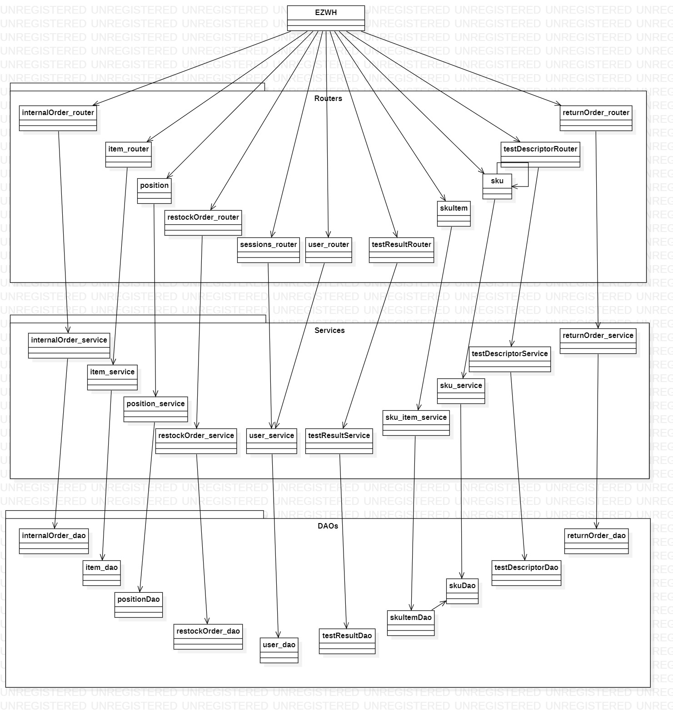

# Integration and API Test Report

Date:

Version:

# Contents

- [Dependency graph](#dependency-graph)

- [Integration approach](#integration)

- [Tests](#tests)

- [Scenarios](#scenarios)

- [Coverage of scenarios and FR](#scenario-coverage)
- [Coverage of non-functional requirements](#nfr-coverage)

# Dependency graph

# Integration approach

    <Write here the integration sequence you adopted, in general terms (top down, bottom up, mixed) and as sequence
    (ex: step1: class A, step 2: class A+B, step 3: class A+B+C, etc)>
    <Some steps may  correspond to unit testing (ex step1 in ex above), presented in other document UnitTestReport.md>
    <One step will  correspond to API testing>

# Integration Tests

## Step 1

See unit tests

## Step 2

| Classes                                         | Jest test cases |
| ----------------------------------------------- | --------------- |
| testInternalOrderDAO + testInternalOrderService |                 |
| testReturnOrderDAO + testReturnOrderService     |                 |
| testItemDAO + testItemService                   |                 |
| testPositionDAO + testPositionService           |                 |
| testSkuDAO + testSkuService                     |                 |
| testSkuItemDAO + testSkuItemService             |                 |
| testDescriptorDAO + testDescriptorService       |                 |
| testResultDAO + testResultService               |                 |
| testUserDAO + testUserService                   |                 |
| testRestockOrderDAO + testRestockOrderService   |                 |

|

## Step 3

| Classes              | Jest test cases       |
| -------------------- | --------------------- |
| returnOrder          | POST returnOrder      |
|                      | GET returnOrder       |
|                      | PUT returnOrder       |
|                      | DELETE returnOrder    |
| internalOrder        | POST internalOrder    |
|                      | GET internalOrder     |
|                      | PUT internalOrder     |
|                      | DELETE internalOrder  |
| item                 | POST item             |
|                      | GET item              |
|                      | PUT item              |
|                      | DELETE item           |
| position             | GET position          |
|                      | POST position         |
|                      | PUT position          |
|                      | DELETE position       |
| sku                  | GET sku               |
|                      | POST sku              |
|                      | PUT sku               |
|                      | DELETE sku            |
| skuItem              | GET skuItem           |
|                      | POST skuItem          |
|                      | PUT skuItem           |
|                      | DELETE skuItem        |
| testDescriptorRouter | GET testDescriptor    |
|                      | POST testDescriptor   |
|                      | PUT testDescriptor    |
|                      | DELETE testDescriptor |
| testResultRouter     | GET testResult        |
|                      | POST testResult       |
|                      | PUT testResult        |
|                      | DELETE testResult     |
| testUser             | GET testUser          |
|                      | POST testUser         |
|                      | PUT testUser          |
|                      | DELETE testUser       |
| testRestockOrder     | GET RestockOrder      |
|                      | POST RestockOrder     |
|                      | PUT RestockOrder      |
|                      | DELETE RestockOrder   |

# API testing - Scenarios

<If needed, define here additional scenarios for the application. Scenarios should be named
referring the UC in the OfficialRequirements that they detail>

| Scenario       |          1.4: Delete sku          |
| -------------- | :-------------------------------: |
| Precondition   | Manager M exists and is logged in |
| Post condition |          Sku is deleted           |
| Step#          |            Description            |
| 1              |       M inserts the sku id        |
| 2              |          M confirms data          |

| Scenario       |       13.1: create sku_item       |
| -------------- | :-------------------------------: |
| Precondition   | Manager M exists and is logged in |
| Post condition |        Sku item is created        |
| Step#          |            Description            |
| 1              |    M inserts the sku item data    |
| 2              |          M confirms data          |

| Scenario       |       13.2: modify sku_item       |
| -------------- | :-------------------------------: |
| Precondition   | Manager M exists and is logged in |
| Post condition |       Sku item is modified        |
| Step#          |            Description            |
| 1              |    M inserts the sku item data    |
| 2              |          M confirms data          |

| Scenario       |       13.3: delete sku_item       |
| -------------- | :-------------------------------: |
| Precondition   | Manager M exists and is logged in |
| Post condition |        Sku item is deleted        |
| Step#          |            Description            |
| 1              |    M inserts the sku item data    |
| 2              |          M confirms data          |

# Coverage of Scenarios and FR

<Report in the following table the coverage of scenarios (from official requirements and from above) vs FR.
Report also for each of the scenarios the (one or more) API Mocha tests that cover it. > Mocha test cases should be here code/server/test

| Scenario ID | Functional Requirements covered | Mocha Test(s)                                                                                                                                                                                                                                                                      |
| ----------- | ------------------------------- | ---------------------------------------------------------------------------------------------------------------------------------------------------------------------------------------------------------------------------------------------------------------------------------- |
| UC 1.1      | FR2.1, FR2.3                    | "POST /api/sku 1", "POST /api/sku 2", "GET /api/skus created"                                                                                                                                                                                                                      |
| UC 1.2      | FR2.1, FR2.4                    | "PUT /api/sku/1/position", "PUT /api/sku/2/position assigned", "PUT /api/sku/2/position full", "POST 422 /api/sku invalid", "GET /api/skus/1 by id modified"                                                                                                                       |
| UC 1.3      | FR2.1, FR2.4                    | "PUT /api/sku/1", "GET /api/skus/1 check position"                                                                                                                                                                                                                                 |
| UC 1.4      | FR2.2                           | "DELETE /api/skus/1","DELETE /api/skus/1"                                                                                                                                                                                                                                          |
| UC 2.1      | FR3.1.1                         | "POST /api/position", "GET /api/positions created"                                                                                                                                                                                                                                 |
| UC 2.2      | FR3.1.1                         | "PUT /api/position/111122223333/changeID", "GET /api/positions id modified", "PUT /api/position/AAAABBBBCCCC/changeID invalid"                                                                                                                                                     |
| UC 2.3      | FR3.1.4, FR3.1.3                | "PUT /api/position/800234543412", "GET /api/positions modified", "PUT /api/position/800234543412/changeID inexistent"                                                                                                                                                              |
| UC 2.4      | FR3.1.4                         | "PUT /api/position/800234543412", "GET /api/positions modified", "PUT /api/position/800234543412/changeID inexistent"                                                                                                                                                              |
| UC 2.5      | FR3.1.2                         | "DELETE /api/position/800234543412"                                                                                                                                                                                                                                                |
| UC 3.1      | FR5.1, FR5.2, FR5.3, FR5.5, FR5.6             | "GET /api/restockOrdersIssued (200)", "POST /api/restockOrder (201)", |                                                                                                                                                                                                                                                                                    |
| UC 3.2      | FR5.1         |"POST /api/restockOrder (201)", "POST /api/restockOrder (422)"                   |                                                                                                                                                                                                                                                                                    |
| UC 4.1      |- | -                            |                                                                                                                                                                                                                                                                                    |
| UC 4.2      | FR1.5, 1.3, 1.4           |"PUT /api/users/user1357@ezwh.com"                  |                                                                                                                                                                                                                                                                                    |
| UC 4.3      | FR1.2      |"Delete /api/users/user58@ezwh.com/customer"                       |                                                                                                                                                                                                                                                                                    |
| UC 5.1.1    | FR5.7      |"PUT /api/restockOrder/:id (200)","PUT /api/restockOrder/:id/transportNote (200)"                      |                                                                                                                                                                                                                                                                                    |
| UC 5.2.1    | FRx, FR3.2.1                    | "POST /api/testDescriptor", "GET on restockOrder", "PUT /api/restockOrder/:id/skuItems (200)"                                                                                                                                                                                                                                                       |
| UC 5.2.2    | FR3.2.1                         | "POST testDescriptor", "POST testResult", "POST /api/testDescriptor (wrong body)", "POST /api/skuitems/testResult", "POST /api/skuitems/testResult (rfid not found)", "POST /api/skuitems/testResult (test descriptor id not found)", "POST /api/skuitems/testResult (wrong body)" |
| UC 5.2.3    | FR3.2.1                         | "POST testDescriptor", "POST testResult", "POST /api/testDescriptor (wrong body)", "POST /api/skuitems/testResult", "POST /api/skuitems/testResult (rfid not found)", "POST /api/skuitems/testResult (test descriptor id not found)", "POST /api/skuitems/testResult (wrong body)" |
| UC 5.3.1    | FR3.2                           | "GET /api/testDescriptors", "GET /api/testDescriptors/1", "GET /api/testDescriptors/3", "GET /api/skuitems/1111/testResults" , "GET /api/skuitems/1111/testResults/1", "GET /api/skuitems/1111/testResults/3", "GET /api/skuitems/WrongRFID/testResults"                           |
| UC 5.3.2    | FR3.2                           | "GET /api/testDescriptors", "GET /api/testDescriptors/1", "GET /api/testDescriptors/3", "GET /api/skuitems/1111/testResults" , "GET /api/skuitems/1111/testResults/1", "GET /api/skuitems/1111/testResults/3", "GET /api/skuitems/WrongRFID/testResults"                           |
| UC 5.3.3    | FR3.2                           | "GET /api/testDescriptors", "GET /api/testDescriptors/1", "GET /api/testDescriptors/3", "GET /api/skuitems/1111/testResults" , "GET /api/skuitems/1111/testResults/1", "GET /api/skuitems/1111/testResults/3", "GET /api/skuitems/WrongRFID/testResults"                           |
| UC 6.1      | FR3.2                           | "GET /api/testDescriptors", "GET /api/testDescriptors/1", "GET /api/testDescriptors/3", "GET /api/skuitems/1111/testResults" , "GET /api/skuitems/1111/testResults/1", "GET /api/skuitems/1111/testResults/3", "GET /api/skuitems/WrongRFID/testResults"                           |
| UC 6.2      | FR3.2                           | "GET /api/testDescriptors", "GET /api/testDescriptors/1", "GET /api/testDescriptors/3", "GET /api/skuitems/1111/testResults" , "GET /api/skuitems/1111/testResults/1", "GET /api/skuitems/1111/testResults/3", "GET /api/skuitems/WrongRFID/testResults"                           |
| UC 7.1      | -           | "POST /api/supplierSessions", "POST /api/qualityEmployeeSessions", "POST /api/deliveryEmployeeSessions"               |                                                                                                                                                                                                                                                                                    |
| UC 7.2      | -      |"POST /api/logout"                      |                                                                                                                                                                                                                                                                                    |
| UC 9.1      | FR6.6                             | "POST /api/internalOrders"                                                                                                                                                                                                                                                         |
| UC 9.2      | FR6.6                             | "PUT /api/internalOrders/10"                                                                                                                                                                                                                                                       |
| UC 9.3      | FR6.7                             | "DELETE /api/internalOrders/10"                                                                                                                                                                                                                                                    |
| UC 10.1     | FR6.7, FR6.8                           | "PUT /api/internalOrders/10"                                                                                                                                                                                                                                                       |
| UC 11.1     | FR7                             | "POST /api/item"                                                                                                                                                                                                                                                                   |
| UC 11.2     | FR7                             | "PUT /api/item/1"                                                                                                                                                                                                                                                                  |
| UC 12.1     | FR3.2.1                         | "POST testDescriptor", "POST testResult", "POST /api/testDescriptor (wrong body)"                                                                                                                                                                                                  |
| UC 12.2     | FR3.2.2                         | "PUT /api/testDescriptor/1", "PUT /api/testDescriptor/1111", "PUT /api/testDescriptor/WrongId", "PUT /api/testDescriptor/1 (wrong body)"                                                                                                                                           |
| UC 12.3     | FR3.2.3                         | "DELETE /api/testDescriptor/1", "DELETE /api/testDescriptor/1111", "DELETE /api/testDescriptor/WrongId"                                                                                                                                                                            |
| UC 13.1     | FR5.8.1                         | "POST /api/skuitem","POST /api/skuitem already existing", "POST /api/skuitem inexisting sku","POST /api/skuitem invalid"                                                                                                                                                           |
| UC 13.2     | FR5.8.3                         | "PUT /api/skuitems/12345678901234567890123456789015", "PUT /api/skuitems/3333444433334444", "GET /api/skuitems/sku/1"                                                                                                                                                              |
| UC 13.3     | -                               | "DELETE /api/skuitems/11112222", "DELETE /api/skuitems/11112222", "GET /api/skuitems empty list"                                                                                                                                                                                   |
