# Design Document

Date: 21 april 2022

Version: 0.1

# Contents

- [High level design](#package-diagram)
- [Low level design](#class-diagram)
- [Verification traceability matrix](#verification-traceability-matrix)
- [Verification sequence diagrams](#verification-sequence-diagrams)

# High level design

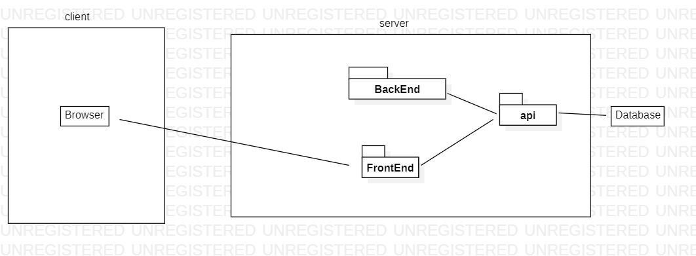

The proposed solution for the ezWh software includes a frontEnd package containing the classes involved in the interfacing of the user with the app. The backEnd instead contains the logic layer, so all the fetching and manipulating of data. The api allow the communication of the software with the database.
The model is then a 3-layer application.

The project implements two high-level patterns:
Architectural pattern: model-view
Behavioural pattern: observer

# Low level design

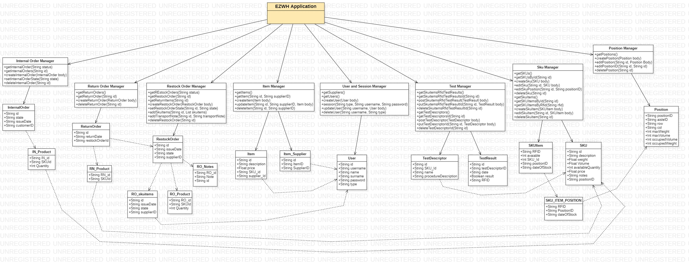

# Verification traceability matrix

| FR                              | InternalOrder | Item | EZWHApplication | User | User&RightsManager | SKU | Inventory | RestockOrder | Supplier | QualityTest | TransportNote | InternalCostumer | Warehouse | TestDescriptor |
| ------------------------------- | :-----------: | :--: | :-------------: | :--: | :----------------: | :-: | :-------: | :----------: | :------: | :---------: | :-----------: | :--------------: | :-------: | :------------: |
| _FR1 Manage users and rights_   |               |      |                 |  x   |         x          |     |           |              |          |             |               |                  |           |                |
| _FR2 Manage SKU_                |               |      |                 |      |                    |  x  |     x     |              |          |             |               |                  |           |                |
| _FR3 Manage Warehouse_          |               |      |                 |      |                    |     |           |              |          |      x      |               |                  |     x     |       x        |
| _FR4 Manage internal customers_ |               |      |                 |      |                    |     |           |              |          |             |               |        x         |           |                |
| _FR5 Manage a restock order_    |               |      |                 |      |                    |     |           |      x       |    x     |             |       x       |                  |           |                |
| _FR6 Manage internal orders_    |       x       |      |                 |      |                    |     |           |              |          |             |               |                  |           |                |
| _FR7 Manage Items_              |               |  x   |                 |      |                    |     |           |              |          |             |               |                  |           |                |

# Verification sequence diagrams

### UC1 - Create SKU

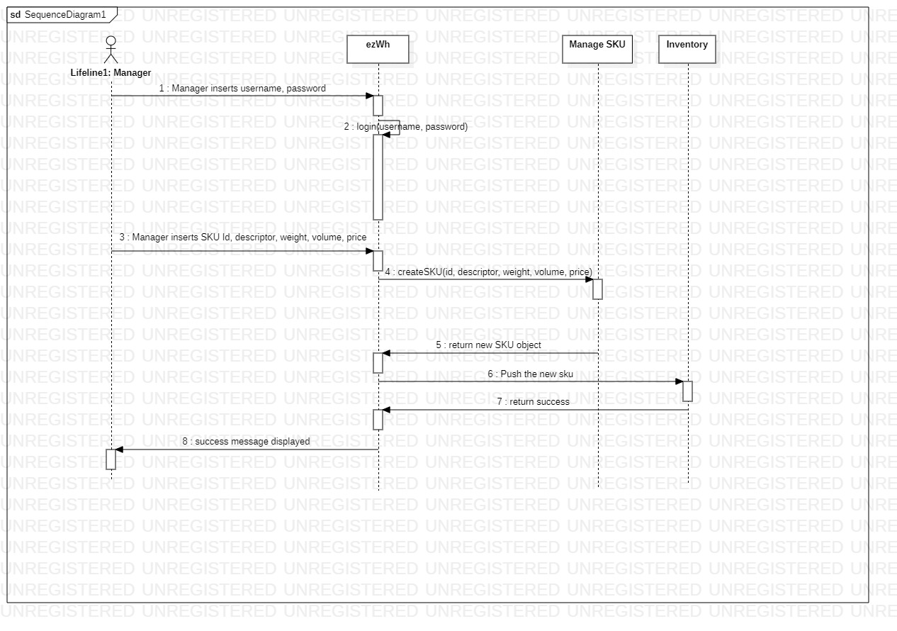

### UC2 - Create Position

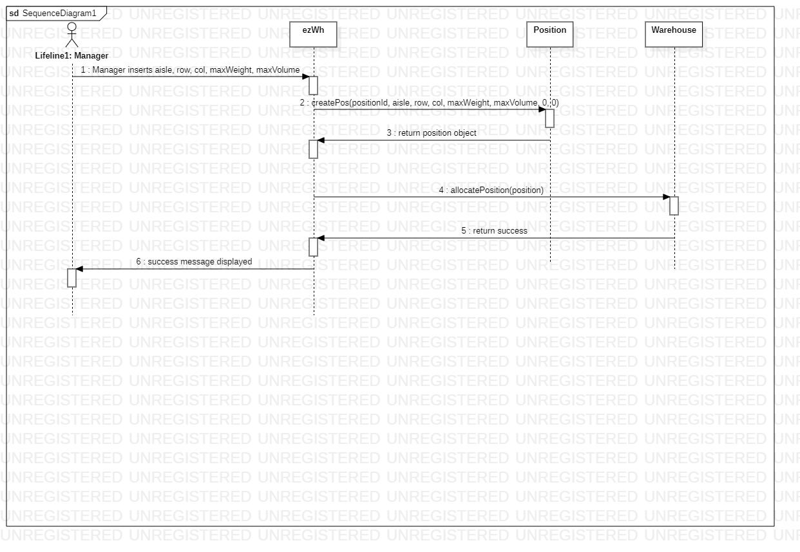

### UC3 - Restock Order of SKU S issued by quantity

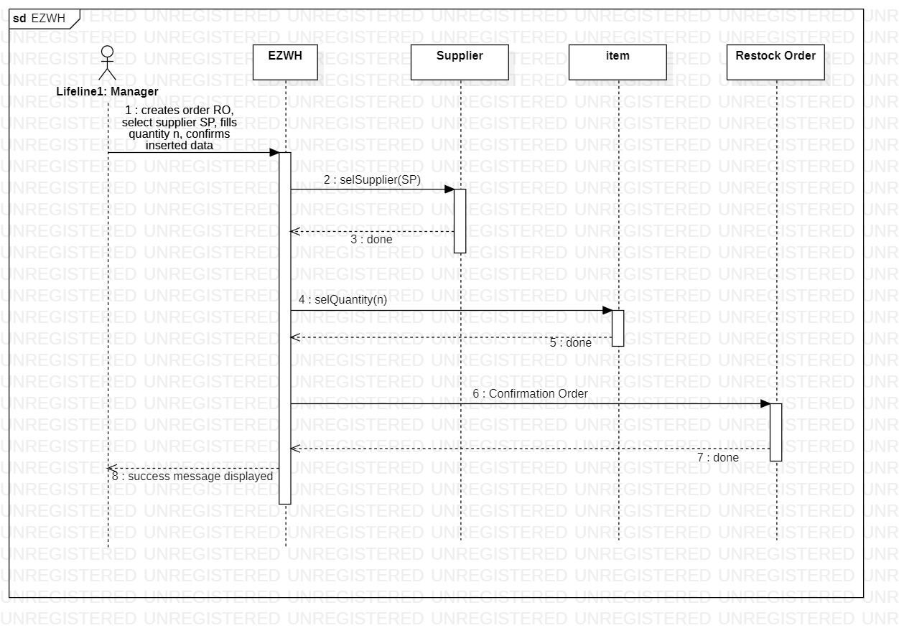

### UC4 - Create user

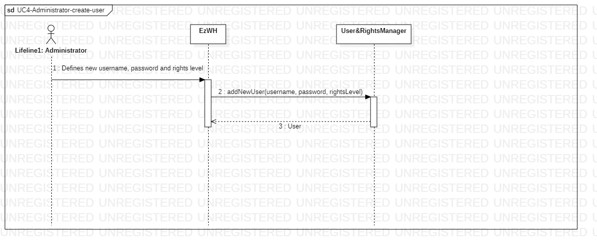

### UC4 - Delete user

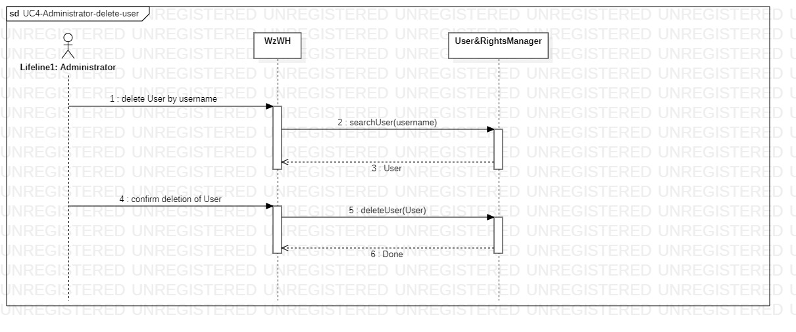

### UC5.1 - Manage reception of SKU Items of a restock Order

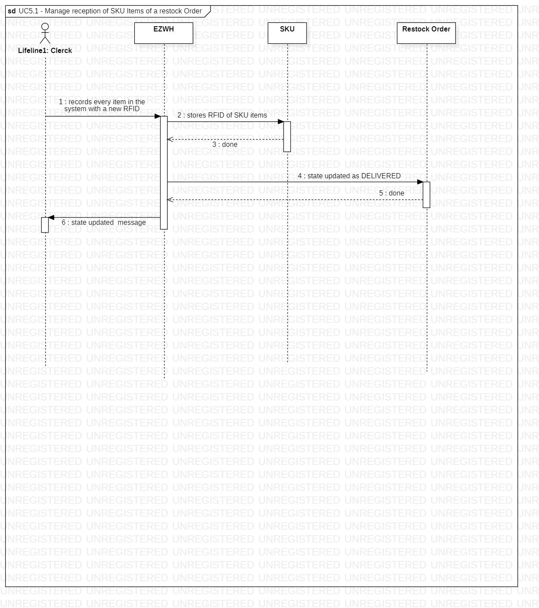

### UC5.2 - Manage testing of SKU Items of a restock Order

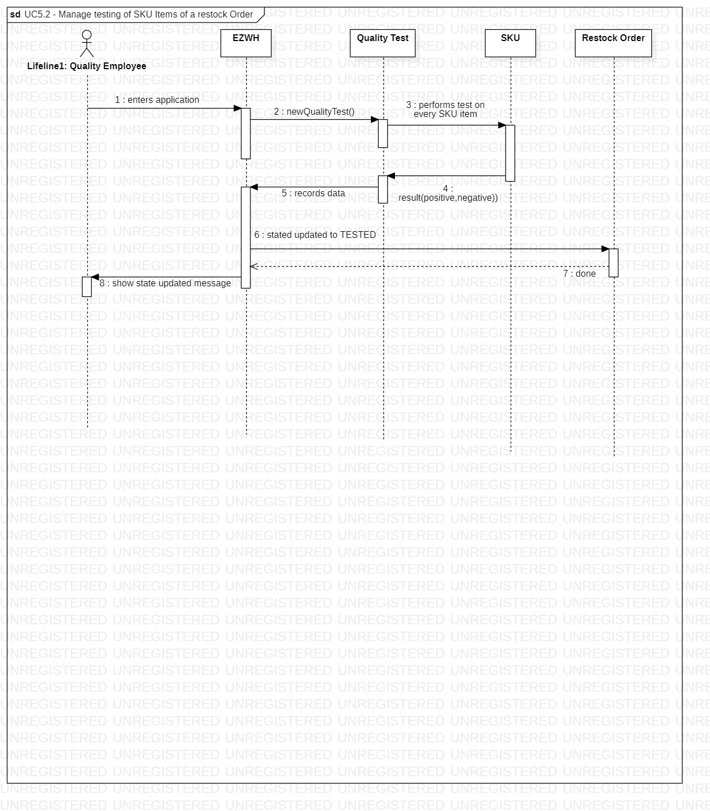

### UC5.3 - Manage acceptance of tested SKU Items of a restock Order

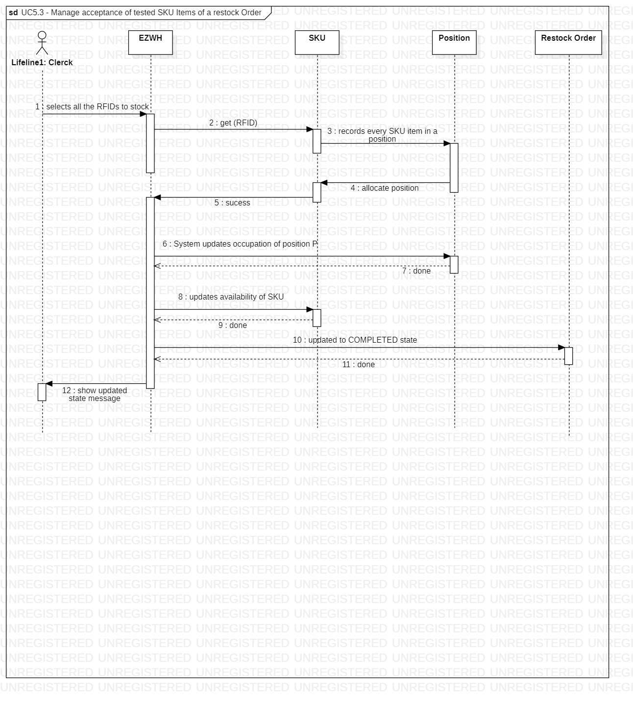

### UC6 - Return order of SKU items that failed quality test

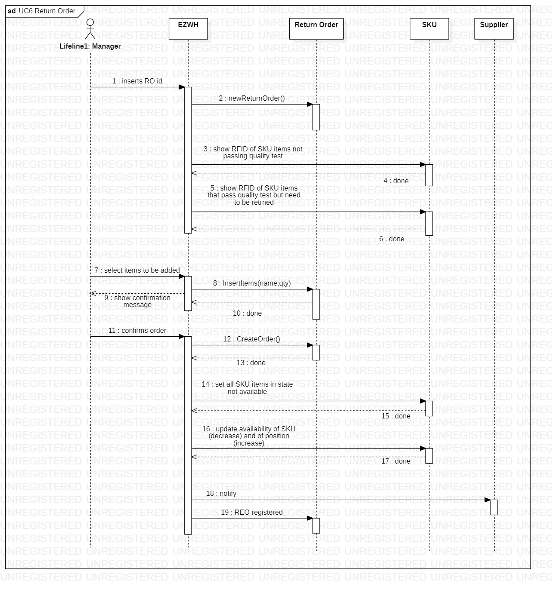

### UC7 - User login

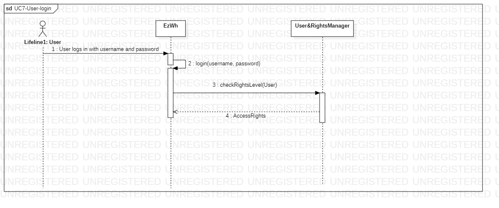

### UC9-UC10 - Internal Order IO accepted/completed

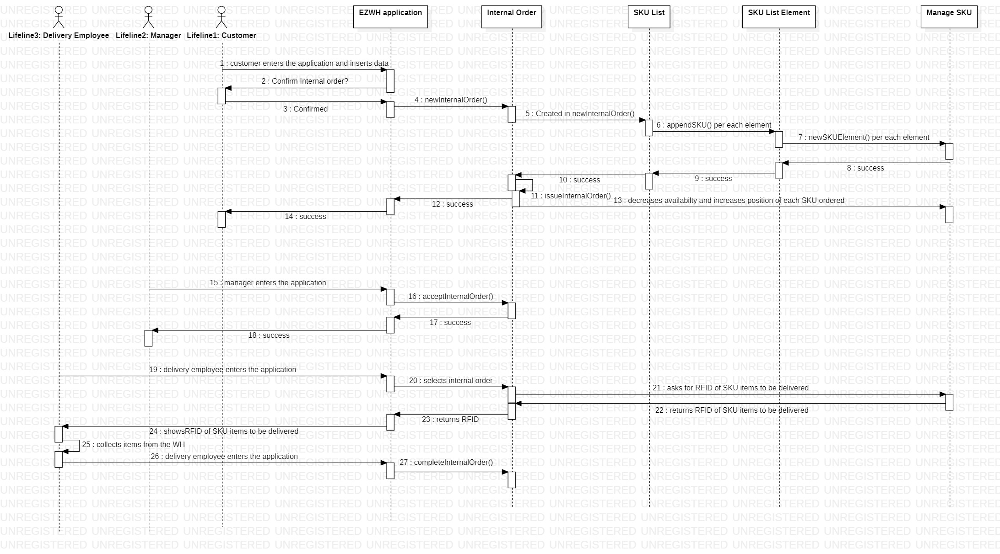

### UC11 - Create Item I

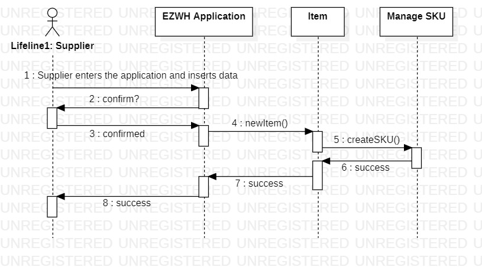

### UC12 - Create test description

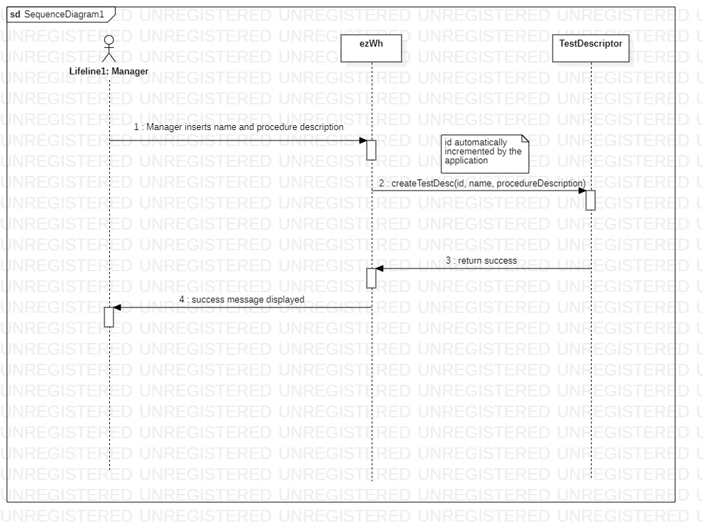
