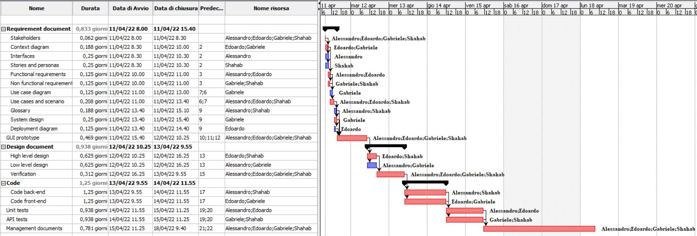

# Project Estimation  
Date: 09/04/2022

Version: 0.1

# Estimation approach
Consider the EZWH  project as described in YOUR requirement document, assume that you are going to develop the project INDEPENDENT of the deadlines of the course
# Estimate by size
### 
|             | Estimate                        |             
| ----------- | ------------------------------- |  
| NC =  Estimated number of classes to be developed   |           10                  |             
|  A = Estimated average size per class, in LOC       |             100               | 
| S = Estimated size of project, in LOC (= NC * A) | 1000 |
| E = Estimated effort, in person hours (here use productivity 10 LOC per person hour)  |   100 ph                                   |   
| C = Estimated cost, in euro (here use 1 person hour cost = 30 euro) | 3000€ | 
| Estimated calendar time, in calendar weeks (Assume team of 4 people, 8 hours per day, 5 days per week ) |       3-4 days           |               

# Estimate by product decomposition
### 
|         component name    | Estimated effort (person hours)   |             
| ----------- | ------------------------------- | 
|requirement document    | 25 |
| GUI prototype | 15 |
|design document | 30 |
|code |40|
| unit tests | 15|
| api tests | 15 |
| management documents | 25 |

# Estimate by activity decomposition
### 
|         Activity name    | Estimated effort (person hours)   |             
| ----------- | ------------------------------- | 
|Requirement document    | 25 |
|- Stakeholders| 2 |
|- Context Diagram| 3| 
|- Interfaces| 2|
|- Stories and personas| 2 |
|- Functional Requirements| 2|
|- Non functional requirements| 2|
|- Use case diagram|1|
|- Use cases and scenario|5|
|- Glossary|3|
|- System design|2|
|- Deployment diagram|1|
| GUI prototype | 15 |
|Design document | 30 |
|- High level design|10|
|- Low level design|10|
|- Verification |10|
|Code |40|
|- Code back-end|20|
|- Code front-end|20|
| Unit tests | 15|
| API tests | 15 |
| Management documents | 25 |

# Summary

Report here the results of the three estimation approaches. The  estimates may differ. Discuss here the possible reasons for the difference

|             | Estimated effort                        |   Estimated duration |          
| ----------- | ------------------------------- | ---------------|
| estimate by size | 100 | 3-4 working days|
| estimate by product decomposition | 165 | 5-6 working days| 
| estimate by activity decomposition | 165| 5-6 working days|

