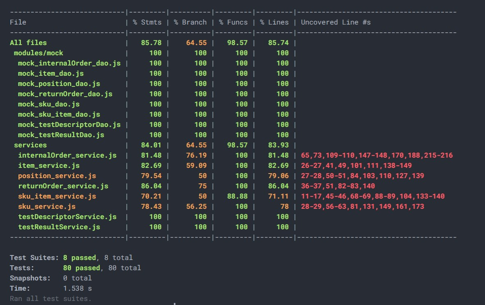

# Unit Testing Report

Date: 25/05/2022

Version: 0.2

# Contents

- [Black Box Unit Tests](#black-box-unit-tests)

- [White Box Unit Tests](#white-box-unit-tests)

# Black Box Unit Tests

    <Define here criteria, predicates and the combination of predicates for each function of each class.
    Define test cases to cover all equivalence classes and boundary conditions.
    In the table, report the description of the black box test case and (traceability) the correspondence with the Jest test case writing the
    class and method name that contains the test case>
    <Jest tests  must be in code/server/unit_test  >

<!--
### **Class *class_name* - method *name***

**Criteria for method *name*:**

 -
 -

**Predicates for method *name*:**

| Criteria | Predicate |
| -------- | --------- |
|          |           |
|          |           |
|          |           |
|          |           |

**Boundaries**:

| Criteria | Boundary values |
| -------- | --------------- |
|          |                 |
|          |                 |

**Combination of predicates**:

| Criteria 1 | Criteria 2 | ... | Valid / Invalid | Description of the test case | Jest test case |
|-------|-------|-------|-------|-------|-------|
|||||||
|||||||
|||||||
|||||||
|||||||
-->

## **Class ReturnOrder - method GET**

**Criteria for method GET:**

- DAO return value

**Predicates for method GET:**

| Criteria         | Predicate     |
| ---------------- | ------------- |
| DAO return value | Success       |
|                  | Not Found     |
|                  | Generic Error |
|                  |               |

**Combination of predicates**:

| Criteria 1    | Valid / Invalid | Description of the test case | Jest test case                               |
| ------------- | --------------- | ---------------------------- | -------------------------------------------- |
| Success       | Valid           |                              | Testing returnOrder SUCCESS / getReturnOrder |
| Not Found     | Invalid         |                              | Testing returnOrder ERROR / getReturnOrder   |
| Generic Error | Invalid         |                              | Testing returnOrder INVALID / getReturnOrder |
|               |                 |                              |                                              |
|               |                 |                              |                                              |

## **Class ReturnOrder - method POST**

**Criteria for method POST:**

- DAO return value

**Predicates for method POST:**

| Criteria         | Predicate     |
| ---------------- | ------------- |
| DAO return value | Success       |
|                  | Not Found     |
|                  | Generic Error |
|                  |               |

**Combination of predicates**:

| Criteria 1    | Valid / Invalid | Description of the test case | Jest test case                                  |
| ------------- | --------------- | ---------------------------- | ----------------------------------------------- |
| Success       | Valid           |                              | Testing returnOrder SUCCESS / createReturnOrder |
| Not Found     | Invalid         |                              | Testing returnOrder ERROR / createReturnOrder   |
| Generic Error | Invalid         |                              | Testing returnOrder INVALID / createReturnOrder |
|               |                 |                              |                                                 |
|               |                 |                              |                                                 |

## **Class ReturnOrder - method DELETE**

**Criteria for method DELETE:**

- DAO return value

**Predicates for method DELETE:**

| Criteria         | Predicate     |
| ---------------- | ------------- |
| DAO return value | Success       |
|                  | Not Found     |
|                  | Generic Error |
|                  |               |

**Combination of predicates**:

| Criteria 1    | Valid / Invalid | Description of the test case | Jest test case                                  |
| ------------- | --------------- | ---------------------------- | ----------------------------------------------- |
| Success       | Valid           |                              | Testing returnOrder SUCCESS / deleteReturnOrder |
| Not Found     | Invalid         |                              | Testing returnOrder ERROR / deleteReturnOrder   |
| Generic Error | Invalid         |                              | Testing returnOrder INVALID / deleteReturnOrder |
|               |                 |                              |                                                 |
|               |                 |                              |                                                 |

## **Class InternalOrder - method GET**

**Criteria for method GET:**

- DAO return value

**Predicates for method GET:**

| Criteria         | Predicate     |
| ---------------- | ------------- |
| DAO return value | Success       |
|                  | Not Found     |
|                  | Generic Error |
|                  |               |

**Combination of predicates**:

| Criteria 1    | Valid / Invalid | Description of the test case | Jest test case                                   |
| ------------- | --------------- | ---------------------------- | ------------------------------------------------ |
| Success       | Valid           |                              | Testing internalOrder SUCCESS / getInternalOrder |
| Not Found     | Invalid         |                              | Testing internalOrder ERROR / getInternalOrder   |
| Generic Error | Invalid         |                              | Testing internalOrder INVALID / getInternalOrder |
|               |                 |                              |                                                  |
|               |                 |                              |                                                  |

## **Class InternalOrder - method POST**

**Criteria for method POST:**

- DAO return value

**Predicates for method POST:**

| Criteria         | Predicate     |
| ---------------- | ------------- |
| DAO return value | Success       |
|                  | Not Found     |
|                  | Generic Error |
|                  |               |

**Combination of predicates**:

| Criteria 1    | Valid / Invalid | Description of the test case | Jest test case                                      |
| ------------- | --------------- | ---------------------------- | --------------------------------------------------- |
| Success       | Valid           |                              | Testing internalOrder SUCCESS / createInternalOrder |
| Not Found     | Invalid         |                              | Testing internalOrder ERROR / createInternalOrder   |
| Generic Error | Invalid         |                              | Testing internalOrder INVALID / createInternalOrder |
|               |                 |                              |                                                     |
|               |                 |                              |                                                     |

## **Class InternalOrder - method PUT**

**Criteria for method PUT:**

- DAO return value

**Predicates for method PUT:**

| Criteria         | Predicate     |
| ---------------- | ------------- |
| DAO return value | Success       |
|                  | Not Found     |
|                  | Generic Error |
|                  |               |

**Combination of predicates**:

| Criteria 1    | Valid / Invalid | Description of the test case | Jest test case                                        |
| ------------- | --------------- | ---------------------------- | ----------------------------------------------------- |
| Success       | Valid           |                              | Testing internalOrder SUCCESS / setInternalOrderState |
| Not Found     | Invalid         |                              | Testing internalOrder ERROR / setInternalOrderState   |
| Generic Error | Invalid         |                              | Testing internalOrder INVALID / setInternalOrderState |
|               |                 |                              |                                                       |
|               |                 |                              |                                                       |

## **Class InternalOrder - method DELETE**

**Criteria for method DELETE:**

- DAO return value

**Predicates for method DELETE:**

| Criteria         | Predicate     |
| ---------------- | ------------- |
| DAO return value | Success       |
|                  | Not Found     |
|                  | Generic Error |
|                  |               |

**Combination of predicates**:

| Criteria 1    | Valid / Invalid | Description of the test case | Jest test case                                      |
| ------------- | --------------- | ---------------------------- | --------------------------------------------------- |
| Success       | Valid           |                              | Testing internalOrder SUCCESS / deleteInternalOrder |
| Not Found     | Invalid         |                              | Testing internalOrder ERROR / deleteInternalOrder   |
| Generic Error | Invalid         |                              | Testing internalOrder INVALID / deleteInternalOrder |
|               |                 |                              |                                                     |
|               |                 |                              |                                                     |

## **Class Item - method GET**

**Criteria for method GET:**

- DAO return value

**Predicates for method GET:**

| Criteria         | Predicate     |
| ---------------- | ------------- |
| DAO return value | Success       |
|                  | Not Found     |
|                  | Generic Error |
|                  |               |

**Combination of predicates**:

| Criteria 1    | Valid / Invalid | Description of the test case | Jest test case                  |
| ------------- | --------------- | ---------------------------- | ------------------------------- |
| Success       | Valid           |                              | Testing item SUCCESS / getItems |
| Not Found     | Invalid         |                              | Testing item ERROR / getItems   |
| Generic Error | Invalid         |                              | Testing item INVALID / getItems |
|               |                 |                              |                                 |
|               |                 |                              |                                 |

## **Class Item - method POST**

**Criteria for method POST:**

- DAO return value

**Predicates for method POST:**

| Criteria         | Predicate     |
| ---------------- | ------------- |
| DAO return value | Success       |
|                  | Not Found     |
|                  | Generic Error |
|                  |               |

**Combination of predicates**:

| Criteria 1    | Valid / Invalid | Description of the test case | Jest test case                     |
| ------------- | --------------- | ---------------------------- | ---------------------------------- |
| Success       | Valid           |                              | Testing item SUCCESS / createItems |
| Not Found     | Invalid         |                              | Testing item ERROR / createItems   |
| Generic Error | Invalid         |                              | Testing item INVALID / createItems |
|               |                 |                              |                                    |
|               |                 |                              |                                    |

## **Class Item - method PUT**

**Criteria for method PUT:**

- DAO return value

**Predicates for method PUT:**

| Criteria         | Predicate     |
| ---------------- | ------------- |
| DAO return value | Success       |
|                  | Not Found     |
|                  | Generic Error |
|                  |               |

**Combination of predicates**:

| Criteria 1    | Valid / Invalid | Description of the test case | Jest test case                    |
| ------------- | --------------- | ---------------------------- | --------------------------------- |
| Success       | Valid           |                              | Testing item SUCCESS / updateItem |
| Not Found     | Invalid         |                              | Testing item ERROR / updateItem   |
| Generic Error | Invalid         |                              | Testing item INVALID / updateItem |
|               |                 |                              |                                   |
|               |                 |                              |                                   |

## **Class Item - method DELETE**

**Criteria for method DELETE:**

- DAO return value

**Predicates for method DELETE:**

| Criteria         | Predicate     |
| ---------------- | ------------- |
| DAO return value | Success       |
|                  | Not Found     |
|                  | Generic Error |
|                  |               |

**Combination of predicates**:

| Criteria 1    | Valid / Invalid | Description of the test case | Jest test case                     |
| ------------- | --------------- | ---------------------------- | ---------------------------------- |
| Success       | Valid           |                              | Testing item SUCCESS / deleteItems |
| Not Found     | Invalid         |                              | Testing item ERROR / deleteItems   |
| Generic Error | Invalid         |                              | Testing item INVALID / deleteItems |
|               |                 |                              |                                    |
|               |                 |                              |                                    |

## **Class position - method GET**

**Criteria for method GET:**

- DAO return value

**Predicates for method GET:**

| Criteria         | Predicate     |
| ---------------- | ------------- |
| DAO return value | Success       |
|                  | Not found     |
|                  | Generic Error |
|                  |               |

**Combination of predicates**:

| Criteria | Valid / Invalid | Description of the test case | Jest test case  |
| -------- | --------------- | ---------------------------- | --------------- |
| Success  | Valid           |                              | "get positions" |
|          |                 |                              |                 |

## **Class position - method POST**

**Criteria for method POST:**

- DAO return value

**Predicates for method POST:**

| Criteria         | Predicate     |
| ---------------- | ------------- |
| DAO return value | Success       |
|                  | Not found     |
|                  | Generic Error |
|                  |               |

**Combination of predicates**:

| Criteria | Valid / Invalid | Description of the test case | Jest test case      |
| -------- | --------------- | ---------------------------- | ------------------- |
| Success  | Valid           |                              | "create a position" |
|          |                 |                              |                     |

## **Class position - method PUT**

**Criteria for method PUT:**

- DAO return value

**Predicates for method PUT:**

| Criteria         | Predicate     |
| ---------------- | ------------- |
| DAO return value | Success       |
|                  | Not found     |
|                  | Generic Error |
|                  |               |

**Combination of predicates**:

| Criteria      | Valid / Invalid | Description of the test case | Jest test case             |
| ------------- | --------------- | ---------------------------- | -------------------------- |
| Success       | Valid           |                              | "edit position successful" |
| Not Found     | Invalid         |                              | "edit position not found"  |
| Generic Error | Invalid         |                              | "edit positionID"          |
|               |                 |                              |                            |

## **Class position - method DELETE**

**Criteria for method DELETE:**

- DAO return value

**Predicates for method DELETE:**

| Criteria         | Predicate     |
| ---------------- | ------------- |
| DAO return value | Success       |
|                  | Not found     |
|                  | Generic Error |
|                  |               |

**Combination of predicates**:

| Criteria  | Valid / Invalid | Description of the test case | Jest test case              |
| --------- | --------------- | ---------------------------- | --------------------------- |
| Not Found | Invalid         |                              | "delete position not found" |
|           |                 |                              |                             |

## **Class sku - method GET**

**Criteria for method GET:**

- DAO return value

**Predicates for method GET:**

| Criteria         | Predicate     |
| ---------------- | ------------- |
| DAO return value | Success       |
|                  | Not found     |
|                  | Generic Error |
|                  |               |

**Combination of predicates**:

| Criteria | Valid / Invalid | Description of the test case | Jest test case              |
| -------- | --------------- | ---------------------------- | --------------------------- |
| Success  | Valid           |                              | "get skus","get skus by id" |
|          |                 |                              |                             |

## **Class sku - method POST**

**Criteria for method POST:**

- DAO return value

**Predicates for method POST:**

| Criteria         | Predicate     |
| ---------------- | ------------- |
| DAO return value | Success       |
|                  | Not found     |
|                  | Generic Error |
|                  |               |

**Combination of predicates**:

| Criteria      | Valid / Invalid | Description of the test case | Jest test case               |
| ------------- | --------------- | ---------------------------- | ---------------------------- |
| Generic Error | Invalid         |                              | "create a sku generic error" |
|               |                 |                              |                              |

## **Class sku - method PUT**

**Criteria for method PUT:**

- DAO return value

**Predicates for method PUT:**

| Criteria         | Predicate            |
| ---------------- | -------------------- |
| DAO return value | Success              |
|                  | Not found            |
|                  | Generic Error        |
|                  | Unprocessible entity |

**Combination of predicates**:

| Criteria             | Valid / Invalid | Description of the test case | Jest test case                |
| -------------------- | --------------- | ---------------------------- | ----------------------------- |
| Success              | Valid           |                              | "editing sku successful"      |
| Not Found            | Invalid         |                              | "editing sku with invalid id" |
| Generic Error        | Invalid         |                              | "editing sku generic error"   |
| Unprocessible entity | Invalid         |                              | "position has no space"       |
|                      |                 |                              |                               |

## **Class sku - method DELETE**

**Criteria for method DELETE:**

- DAO return value

**Predicates for method DELETE:**

| Criteria         | Predicate     |
| ---------------- | ------------- |
| DAO return value | Success       |
|                  | Not found     |
|                  | Generic Error |
|                  |               |

**Combination of predicates**:

| Criteria  | Valid / Invalid | Description of the test case | Jest test case            |
| --------- | --------------- | ---------------------------- | ------------------------- |
| Not Found | Invalid         |                              | "delete a sku inexistent" |
|           |                 |                              |                           |

## **Class skuItem - method GET**

**Criteria for method GET:**

- DAO return value

**Predicates for method GET:**

| Criteria         | Predicate     |
| ---------------- | ------------- |
| DAO return value | Success       |
|                  | Not found     |
|                  | Generic Error |
|                  |               |

**Combination of predicates**:

| Criteria      | Valid / Invalid | Description of the test case | Jest test case                                               |
| ------------- | --------------- | ---------------------------- | ------------------------------------------------------------ |
| Success       | Valid           |                              | "get sku items by rfid","get (available) sku items by skuID" |
| Generic Error | Invalid         |                              | "get sku items generic error"                                |
|               |                 |                              |                                                              |

## **Class skuItem - method POST**

**Criteria for method POST:**

- DAO return value

**Predicates for method POST:**

| Criteria         | Predicate     |
| ---------------- | ------------- |
| DAO return value | Success       |
|                  | Not found     |
|                  | Generic Error |
|                  |               |

**Combination of predicates**:

| Criteria | Valid / Invalid | Description of the test case | Jest test case      |
| -------- | --------------- | ---------------------------- | ------------------- |
| Success  | Valid           |                              | "create a sku item" |
|          |                 |                              |                     |

## **Class skuItem - method PUT**

**Criteria for method PUT:**

- DAO return value

**Predicates for method PUT:**

| Criteria         | Predicate     |
| ---------------- | ------------- |
| DAO return value | Success       |
|                  | Not found     |
|                  | Generic Error |
|                  |               |

**Combination of predicates**:

| Criteria      | Valid / Invalid | Description of the test case | Jest test case                  |
| ------------- | --------------- | ---------------------------- | ------------------------------- |
| Not Found     | Invalid         |                              | "edit a sku item not found"     |
| Generic Error | Invalid         |                              | "edit a sku item generic error" |
|               |                 |                              |                                 |

## **Class skuItem - method DELETE**

**Criteria for method DELETE:**

- DAO return value

**Predicates for method DELETE:**

| Criteria         | Predicate     |
| ---------------- | ------------- |
| DAO return value | Success       |
|                  | Not found     |
|                  | Generic Error |
|                  |               |

**Combination of predicates**:

| Criteria | Valid / Invalid | Description of the test case | Jest test case      |
| -------- | --------------- | ---------------------------- | ------------------- |
| Success  | Valid           |                              | "delete a sku item" |
|          |                 |                              |                     |

## **Class testDescriptor - method GET**

**Criteria for method GET:**

- DAO return value

**Predicates for method GET:**

| Criteria         | Predicate     |
| ---------------- | ------------- |
| DAO return value | Success       |
|                  | Not found     |
|                  | Generic Error |
|                  |               |

**Combination of predicates**:

| Criteria      | Valid / Invalid | Description of the test case | Jest test case                                                          |
| ------------- | --------------- | ---------------------------- | ----------------------------------------------------------------------- |
| Success       | Valid           |                              | "getTestDescriptors success" , "getTestDescriptorsId success"           |
| Not Found     | Invalid         |                              | getTestDescriptorsId not found                                          |
| Generic Error | Invalid         |                              | "getTestDescriptors generic error" , "getTestDescriptors generic error" |
|               |                 |                              |                                                                         |

## **Class testDescriptor - method POST**

**Criteria for method POST:**

- DAO return value

**Predicates for method POST:**

| Criteria         | Predicate     |
| ---------------- | ------------- |
| DAO return value | Success       |
|                  | Not found     |
|                  | Generic Error |
|                  |               |

**Combination of predicates**:

| Criteria      | Valid / Invalid | Description of the test case | Jest test case                   |
| ------------- | --------------- | ---------------------------- | -------------------------------- |
| Success       | Valid           |                              | postTestDescriptor success       |
| Not Found     | Invalid         |                              | postTestDescriptor not found     |
| Generic Error | Invalid         |                              | postTestDescriptor generic error |

|

## **Class testDescriptor - method PUT**

**Criteria for method PUT:**

- DAO return value

**Predicates for method PUT:**

| Criteria         | Predicate     |
| ---------------- | ------------- |
| DAO return value | Success       |
|                  | Not found     |
|                  | Generic Error |
|                  |               |

**Combination of predicates**:

| Criteria      | Valid / Invalid | Description of the test case | Jest test case                    |
| ------------- | --------------- | ---------------------------- | --------------------------------- |
| Success       | Valid           |                              | putTestDescriptorId success       |
| Not Found     | Invalid         |                              | putTestDescriptorId not found     |
| Generic Error | Invalid         |                              | putTestDescriptorId generic error |

|

## **Class testDescriptor - method DELETE**

**Criteria for method DELETE:**

- DAO return value

**Predicates for method DELETE:**

| Criteria         | Predicate     |
| ---------------- | ------------- |
| DAO return value | Success       |
|                  | Generic Error |
|                  |               |

**Combination of predicates**:

| Criteria      | Valid / Invalid | Description of the test case | Jest test case                       |
| ------------- | --------------- | ---------------------------- | ------------------------------------ |
| Success       | Valid           |                              | deleteTestDescriptorId success       |
| Generic Error | Invalid         |                              | deleteTestDescriptorId generic error |

|

## **Class testResult - method GET**

**Criteria for method GET:**

- DAO return value

**Predicates for method GET:**

| Criteria         | Predicate     |
| ---------------- | ------------- |
| DAO return value | Success       |
|                  | Not found     |
|                  | Generic Error |
|                  |               |

**Combination of predicates**:

| Criteria      | Valid / Invalid | Description of the test case | Jest test case                                                                                                          |
| ------------- | --------------- | ---------------------------- | ----------------------------------------------------------------------------------------------------------------------- |
| Success       | Valid           |                              | "getSkuitemsRfidTestResults success", "getSkuitemsRfidTestResultsId success", "getSkuitemsRfidTestResultsId empty list" |
| Not Found     | Invalid         |                              | "getSkuitemsRfidTestResults not found", "getSkuitemsRfidTestResultsId not found"                                        |
| Generic Error | Invalid         |                              | "getSkuitemsRfidTestResults generic error", "getSkuitemsRfidTestResultsId generic error"                                |
|               |                 |                              |                                                                                                                         |

## **Class testResult - method POST**

**Criteria for method POST:**

- DAO return value

**Predicates for method POST:**

| Criteria         | Predicate     |
| ---------------- | ------------- |
| DAO return value | Success       |
|                  | Not found     |
|                  | Generic Error |
|                  |               |

**Combination of predicates**:

| Criteria      | Valid / Invalid | Description of the test case | Jest test case                       |
| ------------- | --------------- | ---------------------------- | ------------------------------------ |
| Success       | Valid           |                              | postSkuitemsTestResult success       |
| Not Found     | Invalid         |                              | postSkuitemsTestResult not found     |
| Generic Error | Invalid         |                              | postSkuitemsTestResult generic error |

## **Class testResult - method PUT**

**Criteria for method PUT:**

- DAO return value

**Predicates for method PUT:**

| Criteria         | Predicate     |
| ---------------- | ------------- |
| DAO return value | Success       |
|                  | Not found     |
|                  | Generic Error |
|                  |               |

**Combination of predicates**:

| Criteria      | Valid / Invalid | Description of the test case | Jest test case                            |
| ------------- | --------------- | ---------------------------- | ----------------------------------------- |
| Success       | Valid           |                              | putSkuitemsRfidTestResultId success       |
| Not Found     | Invalid         |                              | putSkuitemsRfidTestResultId not found     |
| Generic Error | Invalid         |                              | putSkuitemsRfidTestResultId generic error |

## **Class testResult - method DELETE**

**Criteria for method DELETE:**

- DAO return value

**Predicates for method DELETE:**

| Criteria         | Predicate     |
| ---------------- | ------------- |
| DAO return value | Success       |
|                  | Generic Error |
|                  |               |

**Combination of predicates**:

| Criteria      | Valid / Invalid | Description of the test case | Jest test case                               |
| ------------- | --------------- | ---------------------------- | -------------------------------------------- |
| Success       | Valid           |                              | deleteSkuitemsRfidTestResultId success       |
| Generic Error | Invalid         |                              | deleteSkuitemsRfidTestResultId generic error |

|

# White Box Unit Tests

### Test cases definition

    <Report here all the created Jest test cases, and the units/classes under test >
    <For traceability write the class and method name that contains the test case>

| Unit name      | Jest test suite  | Jest test case                               |
| -------------- | ---------------- | -------------------------------------------- |
| returnOrder    | GET functions    | getReturnOrders                              |
|                |                  | getReturnOrder                               |
|                | POST functions   | createReturnOrder                            |
|                | DELETE functions | deleteReturnOrder                            |
| internalOrder  | GET functions    | getInternalOrders                            |
|                |                  | getInternalOrder                             |
|                | POST functions   | createInternalOrder                          |
|                | PUT functions    | setInternalOrderState state                  |
|                | DELETE functions | deleteInternalOrder                          |
| item           | GET functions    | getItems                                     |
|                |                  | getItem                                      |
|                | POST functions   | createItem                                   |
|                | PUT functions    | updateItem price                             |
|                |                  | updateItem description                       |
|                | DELETE functions | deleteItem                                   |
| position       | GET functions    | get positions                                |
|                | POST functions   | create positions                             |
|                | PUT functions    | edit positionID                              |
|                |                  | edit position not found                      |
|                |                  | edit position successful                     |
|                | DELETE functions | delete position not found                    |
| sku            | GET functions    | get skus                                     |
|                |                  | get skus by id                               |
|                | POST functions   | create a sku generic error                   |
|                | PUT functions    | position has no space                        |
|                |                  | editing sku generic error                    |
|                |                  | editing sku successful                       |
|                |                  | editing sku with invalid id                  |
|                | DELETE functions | delete a sku inexistent                      |
| skuItem        | GET functions    | get (available) sku items by skuID           |
|                |                  | get sku items by rfid                        |
|                |                  | get sku items generic error                  |
|                | POST functions   | create a sku item                            |
|                | PUT functions    | edit a sku item not found                    |
|                |                  | edit a sku item generic error                |
|                | DELETE functions | delete a sku item                            |
| testDescriptor | GET functions    | getTestDescriptors success                   |
|                |                  | getTestDescriptors generic error             |
|                |                  | getTestDescriptorsId success                 |
|                |                  | getTestDescriptorsId generic error           |
|                | POST functions   | postTestDescriptor success                   |
|                |                  | postTestDescriptor generic error             |
|                | PUT functions    | putTestDescriptorId success                  |
|                |                  | putTestDescriptorId generic error            |
|                | DELETE functions | deleteTestDescriptorId success               |
|                |                  | deleteTestDescriptorId generic error         |
| testResult     | GET functions    | getSkuitemsRfidTestResults success           |
|                |                  | getSkuitemsRfidTestResults not found         |
|                |                  | getSkuitemsRfidTestResults generic error     |
|                |                  | getSkuitemsRfidTestResultsId success         |
|                |                  | getSkuitemsRfidTestResultsId empty list      |
|                |                  | getSkuitemsRfidTestResultsId not found       |
|                |                  | getSkuitemsRfidTestResultsId generic error   |
|                | POST functions   | postSkuitemsTestResult success               |
|                |                  | postSkuitemsTestResult not found             |
|                |                  | postSkuitemsTestResult generic error         |
|                | PUT functions    | putSkuitemsRfidTestResultId success          |
|                |                  | putSkuitemsRfidTestResultId not found        |
|                |                  | putSkuitemsRfidTestResultId generic error    |
|                | DELETE functions | deleteSkuitemsRfidTestResultId success       |
|                |                  | deleteSkuitemsRfidTestResultId generic error |
|                |                  |                                              |

### Code coverage report

    <Add here the screenshot report of the statement and branch coverage obtained using
    the coverage tool. >

